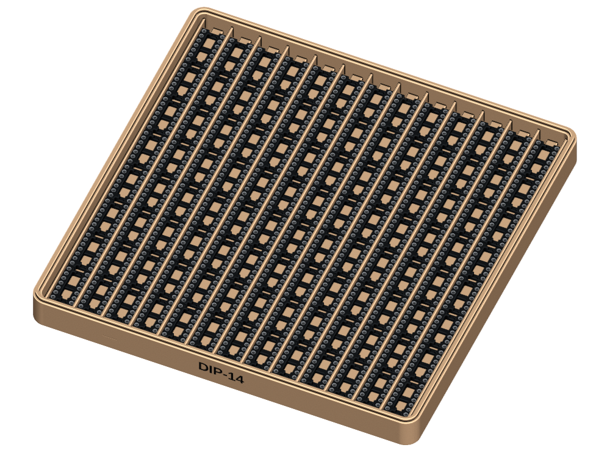
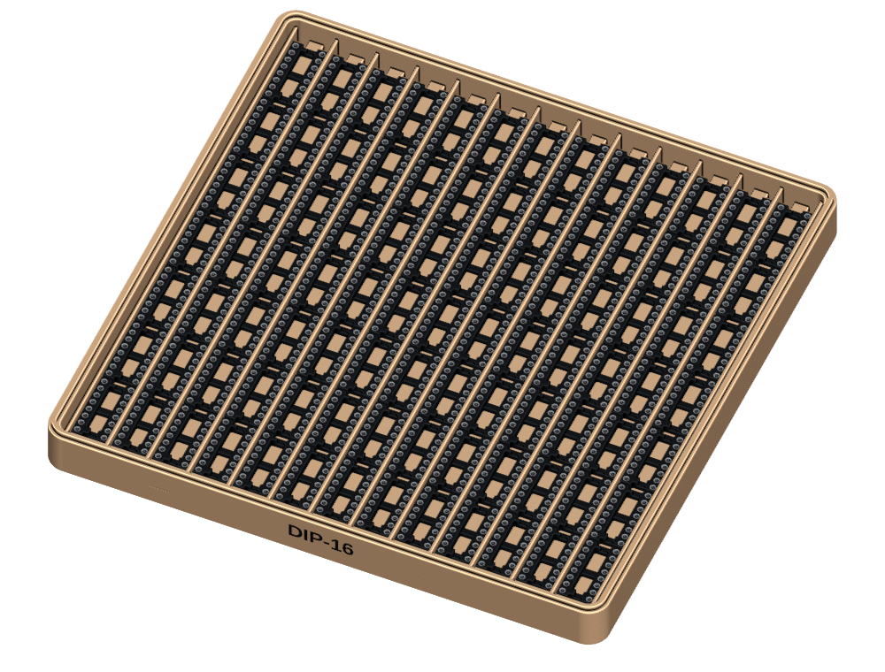
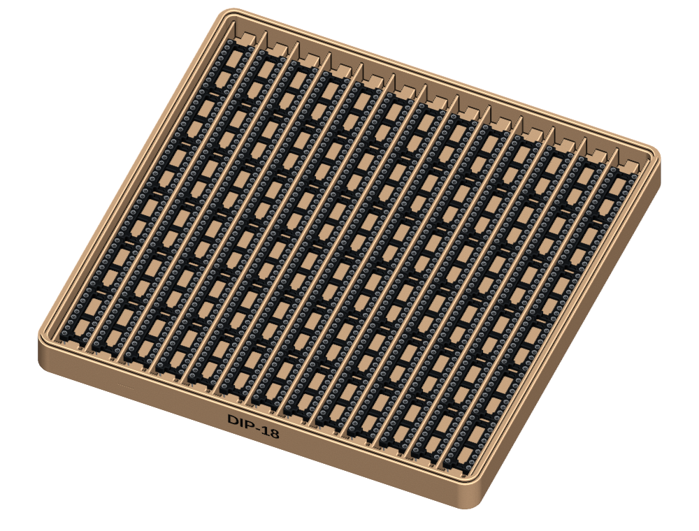
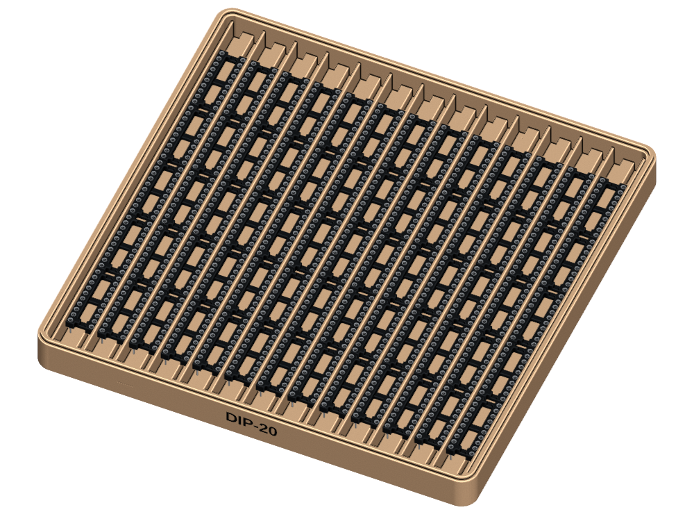
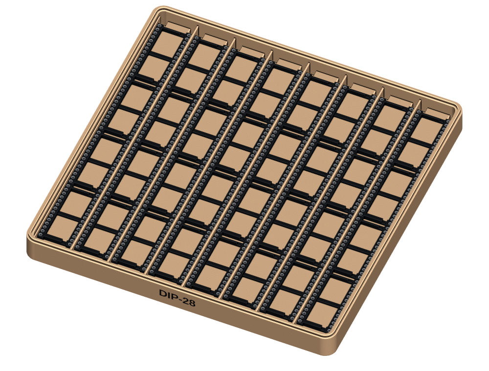
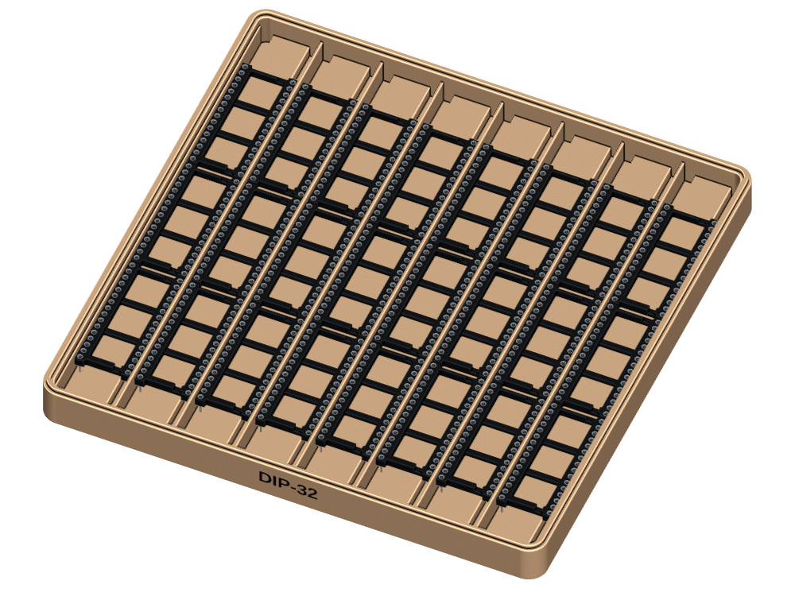
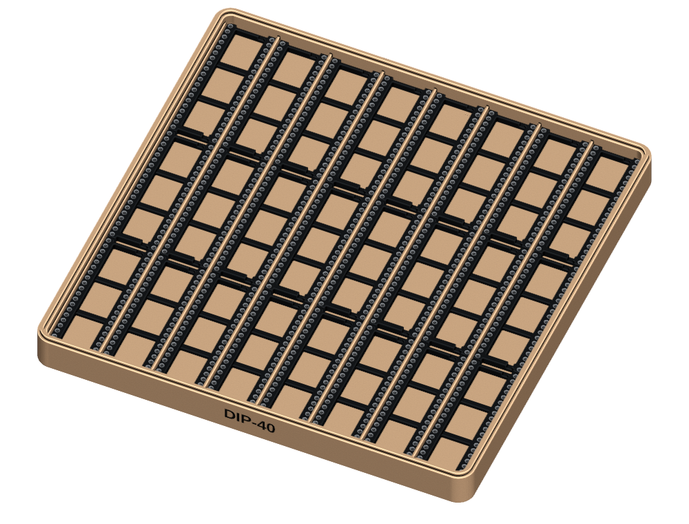

# Parametric DIP socket trays

[](https://github.com/ifilot/parametric-dip-socket-tray/actions/workflows/build-trays.yml)
[](LICENSE)
[](https://openscad.org/)

Stackable 160 × 160 mm storage trays for standard spring-contact DIP sockets.
Each tray holds one socket size in continuous channels that protect the pins
and keep the sockets arranged in neat rows.

## Features

- Seven supported sizes: DIP-14, 16, 18, 20, 28, 32, and 40
- Automatic selection of narrow 300 mil or wide 600 mil geometry
- Central support ridges keep the socket pins above the tray floor
- Capacity calculated automatically from the socket dimensions
- Common interlocking interface allows every tray size to stack together
- 2 mm clearance above stored sockets in a stack
- Recessed size labels with optional two-colour inlays
- Ready-to-print STLs and small fit-test coupons
- Fully parametric OpenSCAD source

## Downloads

**[Download the parametric OpenSCAD source](https://raw.githubusercontent.com/ifilot/parametric-dip-socket-tray/master/dip_socket_tray.scad)** ·
**[Download the complete project](https://github.com/ifilot/parametric-dip-socket-tray/archive/refs/heads/master.zip)** ·
**[Download versioned releases](https://github.com/ifilot/parametric-dip-socket-tray/releases)** ·
**[View automated builds](https://github.com/ifilot/parametric-dip-socket-tray/actions/workflows/build-trays.yml)**

| Socket | Tray | Two-colour label | Fit test |
| --- | --- | --- | --- |
| DIP-14 | [Download STL](https://raw.githubusercontent.com/ifilot/parametric-dip-socket-tray/master/exports/dip14-tray.stl) | [Download label](https://raw.githubusercontent.com/ifilot/parametric-dip-socket-tray/master/exports/dip14-label.stl) | [Download test](https://raw.githubusercontent.com/ifilot/parametric-dip-socket-tray/master/exports/dip14-fit-test.stl) |
| DIP-16 | [Download STL](https://raw.githubusercontent.com/ifilot/parametric-dip-socket-tray/master/exports/dip16-tray.stl) | [Download label](https://raw.githubusercontent.com/ifilot/parametric-dip-socket-tray/master/exports/dip16-label.stl) | [Download test](https://raw.githubusercontent.com/ifilot/parametric-dip-socket-tray/master/exports/dip16-fit-test.stl) |
| DIP-18 | [Download STL](https://raw.githubusercontent.com/ifilot/parametric-dip-socket-tray/master/exports/dip18-tray.stl) | [Download label](https://raw.githubusercontent.com/ifilot/parametric-dip-socket-tray/master/exports/dip18-label.stl) | [Download test](https://raw.githubusercontent.com/ifilot/parametric-dip-socket-tray/master/exports/dip18-fit-test.stl) |
| DIP-20 | [Download STL](https://raw.githubusercontent.com/ifilot/parametric-dip-socket-tray/master/exports/dip20-tray.stl) | [Download label](https://raw.githubusercontent.com/ifilot/parametric-dip-socket-tray/master/exports/dip20-label.stl) | [Download test](https://raw.githubusercontent.com/ifilot/parametric-dip-socket-tray/master/exports/dip20-fit-test.stl) |
| DIP-28 wide | [Download STL](https://raw.githubusercontent.com/ifilot/parametric-dip-socket-tray/master/exports/dip28-tray.stl) | [Download label](https://raw.githubusercontent.com/ifilot/parametric-dip-socket-tray/master/exports/dip28-label.stl) | [Download test](https://raw.githubusercontent.com/ifilot/parametric-dip-socket-tray/master/exports/dip28-fit-test.stl) |
| DIP-32 wide | [Download STL](https://raw.githubusercontent.com/ifilot/parametric-dip-socket-tray/master/exports/dip32-tray.stl) | [Download label](https://raw.githubusercontent.com/ifilot/parametric-dip-socket-tray/master/exports/dip32-label.stl) | [Download test](https://raw.githubusercontent.com/ifilot/parametric-dip-socket-tray/master/exports/dip32-fit-test.stl) |
| DIP-40 wide | [Download STL](https://raw.githubusercontent.com/ifilot/parametric-dip-socket-tray/master/exports/dip40-tray.stl) | [Download label](https://raw.githubusercontent.com/ifilot/parametric-dip-socket-tray/master/exports/dip40-label.stl) | [Download test](https://raw.githubusercontent.com/ifilot/parametric-dip-socket-tray/master/exports/dip40-fit-test.stl) |

## Tray previews

| DIP-14 — 104 sockets | DIP-16 — 91 sockets |
| --- | --- |
|  |  |

| DIP-18 — 78 sockets | DIP-20 — 65 sockets |
| --- | --- |
|  |  |

| DIP-28 wide — 32 sockets | DIP-32 wide — 24 sockets |
| --- | --- |
|  |  |

| DIP-40 wide — 24 sockets |
| --- |
|  |

Socket geometry shown in the previews is derived from the
[KiCad 3D Models library](https://gitlab.com/kicad/libraries/kicad-packages3D),
licensed under [CC BY-SA 4.0 with the KiCad Libraries Exception](https://www.kicad.org/libraries/license/).
The sockets are shown for illustration only and are not included in the
downloadable tray models.

## Supported trays

| Socket | Profile | Rows | Per row | Capacity |
| --- | --- | ---: | ---: | ---: |
| DIP-14 | 300 mil | 13 | 8 | 104 |
| DIP-16 | 300 mil | 13 | 7 | 91 |
| DIP-18 | 300 mil | 13 | 6 | 78 |
| DIP-20 | 300 mil | 13 | 5 | 65 |
| DIP-28 | 600 mil | 8 | 4 | 32 |
| DIP-32 | 600 mil | 8 | 3 | 24 |
| DIP-40 | 600 mil | 8 | 3 | 24 |

Sockets lie end-to-end in long channels. Their plastic bodies rest on a
central ridge while both pin rows float in continuous trenches. The channel
guides rise 4.2 mm above the support surface to keep sockets aligned.

The validated profiles use:

| Dimension | Narrow sockets | Wide sockets |
| --- | ---: | ---: |
| Pin-row spacing | 7.62 mm | 15.24 mm |
| Overall socket width | 10.16 mm | 17.78 mm |
| Central support ridge | 4.0 mm | 11.5 mm |

Socket length is derived from the 2.54 mm pin pitch and selected pin count.

## Using the OpenSCAD model

Open `dip_socket_tray.scad` and set `pins` to one of:

```text
14, 16, 18, 20, 28, 32, 40
```

The narrow or wide profile is selected automatically. Use `part` to choose
the output:

- `assembly` — preview the tray, contrasting label, and reference sockets
- `tray` — printable tray with recessed lettering
- `label` — separate label inlay for two-colour printing
- `fit_test` — short channel for checking socket fit and pin clearance

The model prints the calculated capacity and stacking pitch in OpenSCAD's
console. Ready-to-print tray, label, and fit-test STLs are available in
`exports/`.

## Fit and customization

The supplied fit tests have been physically verified with the intended socket
styles. For other socket brands or constructions, print a fit test before a
complete tray.

Useful parameters include:

- `narrow_socket_width`, `wide_socket_width`, and `side_clearance`
- `pin_drop` and `pin_clearance`
- `narrow_support_ridge_width` and `wide_support_ridge_width`
- `socket_height` and `vertical_clearance`
- `stack_fit` and `stack_groove_depth`

## Printing

Suggested PLA settings:

- 0.25 mm layer height
- Three perimeters
- 15–20% infill
- No supports

The printer must provide a build area of at least 160 × 160 mm.

## Building all trays

With OpenSCAD available on the command line, generate all 21 tray, label, and
fit-test STLs with:

```sh
bash scripts/build_all.sh
```

Output is written to `build/` by default. Pass a directory as the first
argument to use a different destination. GitHub Actions runs the same script
for pushes and pull requests that affect the model or build procedure, then
publishes the complete STL set as a downloadable workflow artifact.

## Versioning and releases

This project follows [Semantic Versioning](https://semver.org/). The current
version is recorded in [`VERSION`](VERSION), and release notes are maintained
in [`CHANGELOG.md`](CHANGELOG.md).

## Stacking interface

Every variant uses the same perimeter lip and underside groove:

| Feature | Dimension |
| --- | ---: |
| Lip width | 1.20 mm |
| Lip height | 1.20 mm |
| Groove width | 1.80 mm |
| Groove depth | 1.40 mm |
| Horizontal clearance | 0.30 mm per side |
| Vertical clearance inside groove | 0.20 mm |

The groove locates the upper tray while perimeter ledges carry its weight, so
the lip does not bottom out. All socket sizes can be stacked in any order.

## Two-colour labels

Export the tray and label separately:

```sh
openscad -o dip14-tray.stl -D 'pins=14' -D 'part="tray"' dip_socket_tray.scad
openscad -o dip14-label.stl -D 'pins=14' -D 'part="label"' dip_socket_tray.scad
```

Import the matching tray and label STLs into a multi-material slicer as parts
of the same object. Keep both at their original coordinates, then assign each
part to the desired material or colour. Do not auto-arrange the parts
separately.

For single-colour printing, export only `tray`; the label remains recessed.

## License

This open hardware design is licensed under the CERN Open Hardware Licence
Version 2 — Strongly Reciprocal (`CERN-OHL-S-2.0`). You may use, modify,
manufacture, and sell products based on it under the terms in `LICENSE`.
Distributed modifications and products must retain the required notices and
make the corresponding complete source available.
